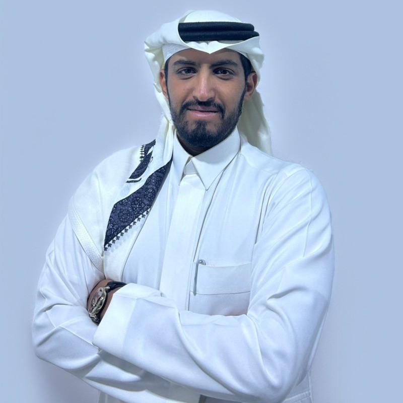

# Ahmed Alzahrani - Professional Portfolio 🚀

[](https://sczi7.com)
[](LICENSE)



Welcome to my professional portfolio website! This repository contains the source code for my personal portfolio showcasing my experience, skills, and professional journey as a Field Support Engineer with 7+ years of experience.

## ✨ Features

- **🎨 Modern Design**: Clean and professional UI with smooth animations and transitions
- **📱 Fully Responsive**: Works perfectly on all devices (desktop, tablet, mobile)
- **🌐 Multi-Language**: Toggle between English (EN) and Arabic (AR) with RTL support
- **⚡ Fast Performance**: Optimized CSS and JavaScript with minimal dependencies
- **♿ Accessible**: WCAG 2.1 AA compliant with screen reader support
- **🎯 SEO Optimized**: Meta tags, sitemap, and semantic HTML structure
- **📱 PWA Ready**: Installable, works offline, push notifications ready
- **🔒 Secure**: Security headers, CSP, HTTPS ready
- **📊 Analytics**: Google Analytics integration with privacy controls

## 🛠️ Technologies Used

| Technology | Purpose |
|------------|---------|
| HTML5 | Semantic structure |
| CSS3 | Modern styling with custom properties |
| JavaScript (ES6+) | Interactive functionality |
| [Font Awesome 6.5.1](https://fontawesome.com/) | Icons |
| [Google Fonts (Poppins)](https://fonts.google.com/) | Typography |

## 📂 Project Structure

```
Sczi7-WEB/
├── index.html              # Main HTML file
├── manifest.json           # PWA manifest
├── sw.js                   # Service Worker
├── offline.html            # Offline fallback page
├── .htaccess              # Security & performance config
├── robots.txt             # SEO robots configuration
├── sitemap.xml            # XML sitemap
├── .gitignore            # Git ignore rules
│
├── 📁 docs/               # Documentation
│   ├── GUIDE.md          # Complete guide (English/Arabic)
│   └── CHANGELOG.md      # Version history
│
├── 📁 tools/             # Development tools
│   └── minify-tool.html  # CSS/JS minification tool
│
└── 📁 src/assets/
    ├── css/
    │   └── styles.css        # Main stylesheet
    ├── js/
    │   ├── script.js         # Main functionality
    │   ├── language.js       # Multi-language support
    │   ├── translations.js   # Translation strings
    │   ├── accessibility.js  # WCAG 2.1 AA compliance
    │   └── analytics.js      # Google Analytics
    ├── images/
    │   └── MyPhoto.jpg      # Profile photo
    ├── icon/
    │   └── icon.png         # PWA icon
    └── CV.pdf               # Downloadable resume
```

## 🎨 Design Features

### Color Palette
```css
Primary:   #6366f1 (Indigo)
Secondary: #0ea5e9 (Sky Blue)
Accent:    #f59e0b (Amber)
Background: #0f172a (Dark Slate)
Text:      #f1f5f9 (Light)
```

### Typography
- **Font Family**: Poppins (300, 400, 500, 600, 700 weights)
- **Font Sizes**: Responsive scaling from 0.75rem to 3rem
- **Line Height**: 1.6 for optimal readability

### Animations
- Smooth scroll behavior
- Fade-in animations on scroll
- Hover effects on interactive elements
- Parallax effect on hero section
- Counter animations for statistics

## 🌐 Multi-Language Support

The website supports both English and Arabic with complete translations:

- ✅ All sections translated (Home, About, Experience, Skills, Education, Contact)
- ✅ RTL (Right-to-Left) layout support for Arabic
- ✅ Language preference saved in localStorage
- ✅ Dynamic meta tag updates based on language
- ✅ Custom Arabic font loading (Cairo)

### Supported Languages
- 🇬🇧 English (EN) - Default
- 🇸🇦 Arabic (AR) - عربي

## 🚀 Quick Start

### Option 1: Direct Access
Simply open [index.html](index.html) in any modern web browser. No build process required!

### Option 2: Local Server
For better testing (especially for service workers):

```bash
# Using Python 3
python -m http.server 8000

# Using Node.js (http-server)
npx http-server -p 8000

# Using PHP
php -S localhost:8000
```

Then visit: `http://localhost:8000`

## 📱 Browser Support

| Browser | Minimum Version |
|---------|----------------|
| Chrome  | 90+ |
| Firefox | 88+ |
| Safari  | 14+ |
| Edge    | 90+ |

## 🎯 Sections Overview

### 1. Hero Section
- Professional introduction
- Profile photo
- Call-to-action buttons
- Social media links

### 2. About
- Professional summary
- Key statistics (Years experience, Client satisfaction, etc.)
- Animated counters

### 3. Experience
- Timeline-style layout
- 3 positions with detailed achievements
- Date ranges and company information

### 4. Skills
- Technical skills
- Soft skills
- Certifications and coursework

### 5. Education
- Bachelor's degree information
- Institution details
- Graduation year

### 6. Contact
- Email address
- LinkedIn profile
- Location
- CV download button

## 🔧 Customization

### Change Colors
Edit CSS custom properties in [styles.css](src/assets/css/styles.css):

```css
:root {
    --primary-color: #6366f1;  /* Change to your color */
    --secondary-color: #0ea5e9;
    --accent-color: #f59e0b;
}
```

### Update Content
Edit [translations.js](src/assets/js/translations.js):

```javascript
const translations = {
    en: { /* English content */ },
    ar: { /* Arabic content */ }
};
```

### Modify Animations
Adjust animation timings in [script.js](src/assets/js/script.js):

```javascript
const observerOptions = {
    threshold: 0.1,
    rootMargin: '0px 0px -100px 0px'
};
```

## 📊 Performance

- **HTML**: Semantic and valid HTML5
- **CSS**: ~1224 lines, modular structure with CSS variables
- **JavaScript**: Vanilla JS, no heavy frameworks
- **Images**: Optimized profile photo
- **Load Time**: < 2 seconds on average connection

## 🔒 Security Features

- ✅ No inline scripts (CSP friendly)
- ✅ External links open in new tab with proper security
- ✅ Input validation for contact form
- ✅ No sensitive data exposed

## 📈 SEO Features

- ✅ Semantic HTML5 structure
- ✅ Meta tags (description, keywords, author)
- ✅ Open Graph tags for social media
- ✅ XML sitemap
- ✅ robots.txt configuration
- ✅ Schema.org structured data ready

## 🎓 Learning Resources

This portfolio demonstrates:
- Modern CSS techniques (Grid, Flexbox, Custom Properties)
- JavaScript ES6+ features
- Responsive web design principles
- Multi-language web applications
- Smooth animations and transitions
- Local storage usage
- Intersection Observer API
- Modern web best practices

## 📚 Documentation

- **[docs/GUIDE.md](docs/GUIDE.md)** - Complete setup and usage guide (English/Arabic)
- **[docs/CHANGELOG.md](docs/CHANGELOG.md)** - Version history and updates
- **[IMPROVEMENTS.md](IMPROVEMENTS.md)** - Recommended enhancements
- **[tools/minify-tool.html](tools/minify-tool.html)** - Minification utility

## 🎯 Professional Highlights

- **7+** years in IT infrastructure
- **98%** client satisfaction rate
- **95%** network uptime achievement
- **30%** reduction in resolution time

## 📄 License

© 2025 Ahmed Alzahrani. All rights reserved.

This project is proprietary. You may view the code for reference, but copying, modification, or distribution requires permission.

## 📞 Contact

**Ahmed Alzahrani** - Field Support Engineer

- 📧 **Email**: [l5r@outlook.sa](mailto:l5r@outlook.sa)
- 💼 **LinkedIn**: [linkedin.com/in/ahmalzahrani](https://linkedin.com/in/ahmalzahrani)
- 🐙 **GitHub**: [github.com/scz0x](https://github.com/scz0x)
- 📍 **Location**: Abha, Saudi Arabia
- 🌐 **Website**: [sczi7.com](https://sczi7.com)

---

<div align="center">

**Made with ❤️ by Ahmed Alzahrani**

If you find this portfolio inspiring, feel free to ⭐ star this repository!

</div>
